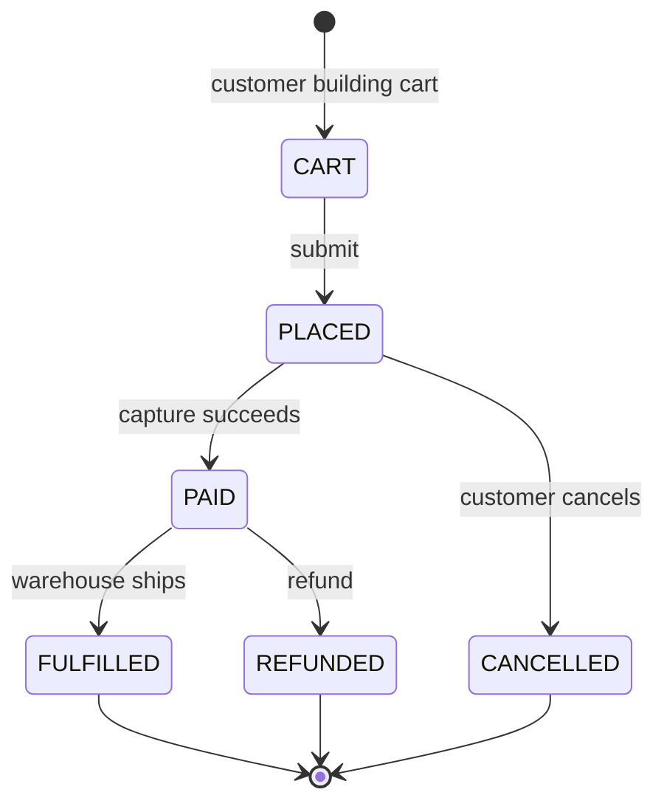
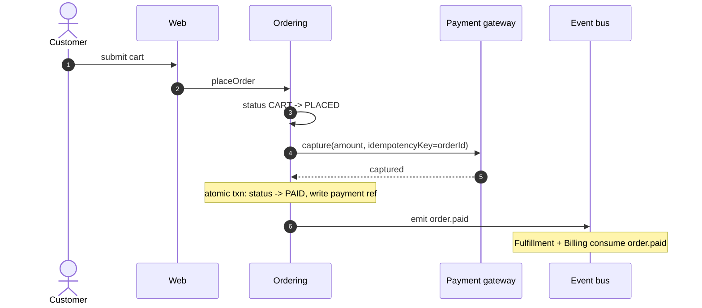

# Ordering

The [[Order]] lifecycle: from cart submission through payment capture to hand-off to
[fulfillment](../sub-modules/ordering/state-machine.md) and [[Billing]]. This is the **load-bearing**
context of the example system — an order is the only thing that moves money and inventory, so any
defect here has direct customer and revenue consequences. (This page is the shipped exemplar; it sets
the depth bar for authoring a new context panel.)

## Summary

A [[Customer]] submits a [[Cart]], creating an `orders` row whose lifecycle is governed by the
`OrderStatus` enum. Payment is captured through the external [[Payment gateway]]; on success the order
is handed to [[Fulfillment]] and an invoice is produced by [[Billing]]. Cross-context communication is
by domain event, not synchronous call ([ADR 0001](/docs/adr/0001-events-not-http.md)), and every
other context references an order by id only ([ADR 0002](/docs/adr/0002-id-references-only.md)).

> **Critical: payment capture is not idempotent at the gateway.** A retried capture can double-charge.
> All gateway calls go through an idempotency key derived from the order id, so retries are de-duped.
> Any change to the capture path requires explicit review.

## State machine

Full enum (per [`packages/ordering/src/schema.ts`](/packages/ordering/src/schema.ts)): `CART`,
`PLACED`, `PAID`, `FULFILLED`, `CANCELLED`, `REFUNDED`, `ON_HOLD`.

> **Inert enum slot.** `ON_HOLD` has **no writers in the current code** — it's reserved, not an active
> state. Don't pattern-match on it; if you need "awaiting manual review", derive it from the presence
> of an open `holds` row, not from `OrderStatus`.

## Golden-path sequence (checkout)

> **Capture and status advance are one transaction.** If anything throws after capture — event emit
> failure, write conflict — the whole `placeOrder` transaction rolls back to `PLACED`; there is no
> stuck "paid-but-not-recorded" state to recover from. The gateway's idempotency key makes the retried
> capture a no-op.

## Sub-modules (click to zoom)

- [Order state machine](../sub-modules/ordering/state-machine.md) — the full `OrderStatus` enum, the
  cancel/refund branches, and the post-capture rollback boundary.

## Interfaces — consumed

| From         | What                                   | Where |
| ------------ | -------------------------------------- | ----- |
| [[Catalog]]  | product + price snapshot at cart time  | DB    |
| [[Customer]] | session identity on the checkout route | auth  |

## Interfaces — produced

| To              | What                            | Mechanism   |
| --------------- | ------------------------------- | ----------- |
| [[Fulfillment]] | `order.paid` (ship this order)  | event bus   |
| [[Billing]]     | `order.paid` (invoice this)     | event bus   |

## Key files

- [`packages/ordering/src/checkout.ts`](/packages/ordering/src/checkout.ts) — `placeOrder` (the transactional capture path)
- [`packages/ordering/src/schema.ts`](/packages/ordering/src/schema.ts) — `OrderStatus`, `orders`, `holds` models
- [`packages/ordering/src/refund.ts`](/packages/ordering/src/refund.ts) — refund path and gateway reversal

## Gotchas

- **Capture is not idempotent at the gateway.** Always pass the order-id idempotency key; never call capture directly.
- **`ON_HOLD` has no writers.** Don't treat it as a real state — derive "on hold" from an open `holds` row.
- **Price is snapshotted at cart time.** A later catalog price change does not alter a `PLACED` order.
- **Refund touches the gateway, not just the DB.** A DB-only status flip to `REFUNDED` without a gateway reversal leaves money uncaptured-back — always go through `refund.ts`.

## Related contexts

- [Billing](02-billing.md) — consumes `order.paid` to produce the invoice.
- [Fulfillment](03-fulfillment.md) — consumes `order.paid` to start picking.

## Related ADRs

- [0001 — Events between contexts, not synchronous HTTP](/docs/adr/0001-events-not-http.md)
- [0002 — Cross-context references by ID only](/docs/adr/0002-id-references-only.md)
