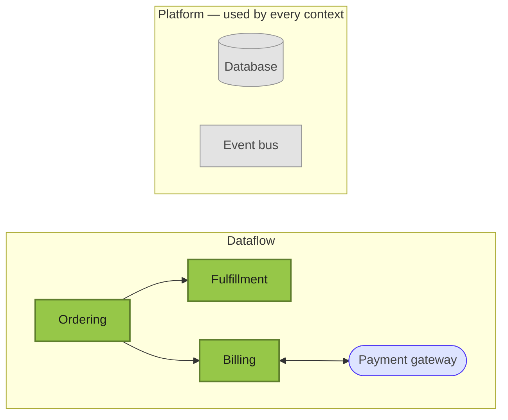

# Project — Technical Overview

A generic example knowledge bank for a small commerce platform. The short version of the core flow:

> A customer places an **Order**; once payment is captured the order is handed to **Fulfillment** for
> picking and shipping, and **Billing** issues the invoice. This page is the worked example shipped
> with the skill — replace it (and the registries it pairs with) when you scaffold your own repo.

## What this site is

A drill-down view of the system. Each box in the **System map** below is a _domain context_ — a
bounded slice with its own state machine, key files, and gotchas. Click a box to zoom in. The sidebar
holds the navigation; press **g** for the searchable glossary; hover any dashed-underlined term in
prose for an inline definition.

If you're new, read the root [`CONTEXT.md`](/CONTEXT.md) glossary first, then come back here. The
most-developed context page is [Ordering](contexts/01-ordering.md) — read it as the depth target when
authoring a new panel.

## System map

**How to read this map.** Click any green box to jump into that context's panel. Green = domain
context; grey = platform; pale blue = external. The mermaid node ids (`ORD`, `BILL`, `FUL`) are the
keys of `NODE_TO_SLUG` in `index.html` — that's what makes the boxes clickable, so keep them in sync.

## Reading order

| If you're…                   | Read…                                                                                  |
| ---------------------------- | -------------------------------------------------------------------------------------- |
| New to the codebase          | Root [`CONTEXT.md`](/CONTEXT.md) → this page → [Ordering](contexts/01-ordering.md).     |
| Investigating a payment bug  | [Billing](contexts/02-billing.md) → trace the capture/refund path.                     |
| Touching the order lifecycle | [Ordering](contexts/01-ordering.md) + [Order state machine](sub-modules/ordering/state-machine.md). |
| Hunting an ADR for a decision| Sidebar Reference → ADRs.                                                               |
